# Задача 1

https://hub.docker.com/repository/docker/kolez0/general

# Задача 2

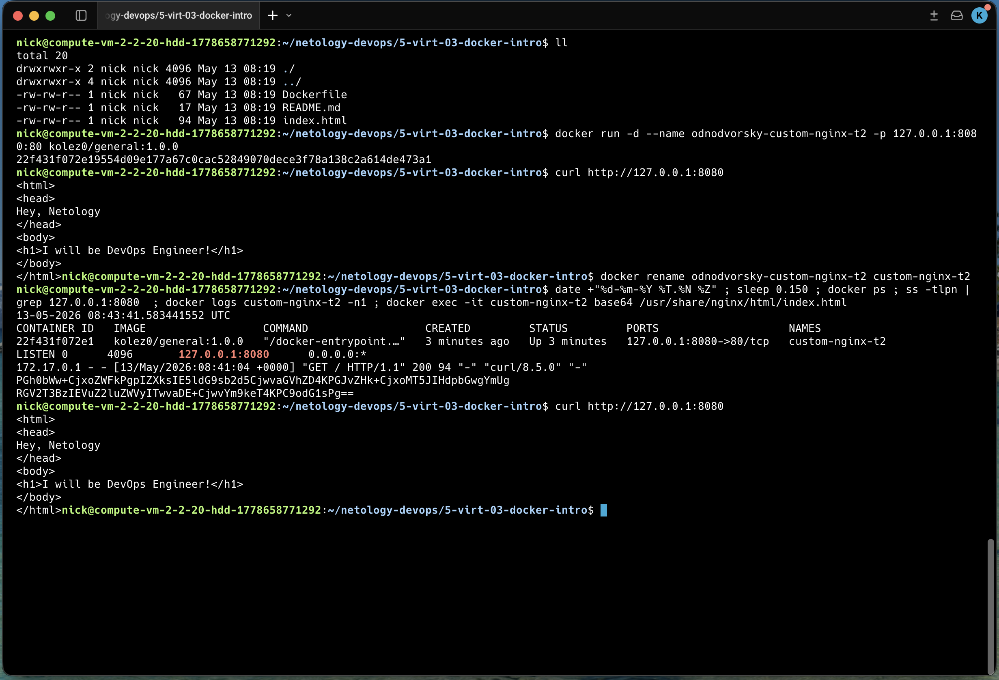

# Задача 3

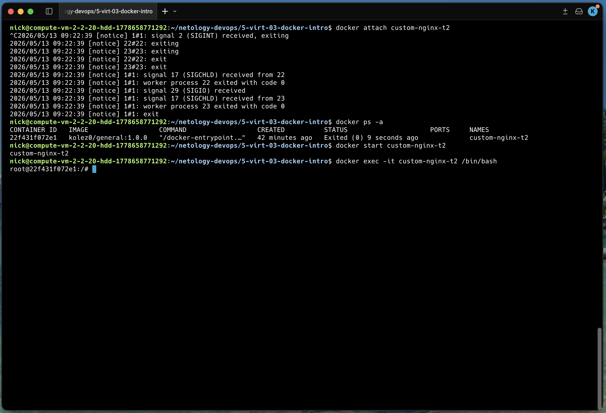

К контейнеру подключаемся посредством docker attach, что по сути подключает наш терминал к процессу внутри контейнера, аналогично если бы мы запустили контейнер без ключа -d, и соответственно нажатие Ctrl-C прерывает выполнение контейнера.

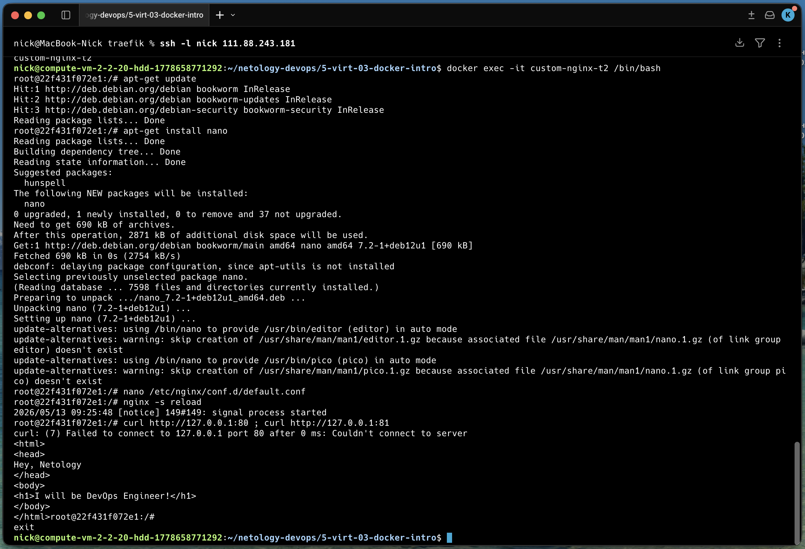

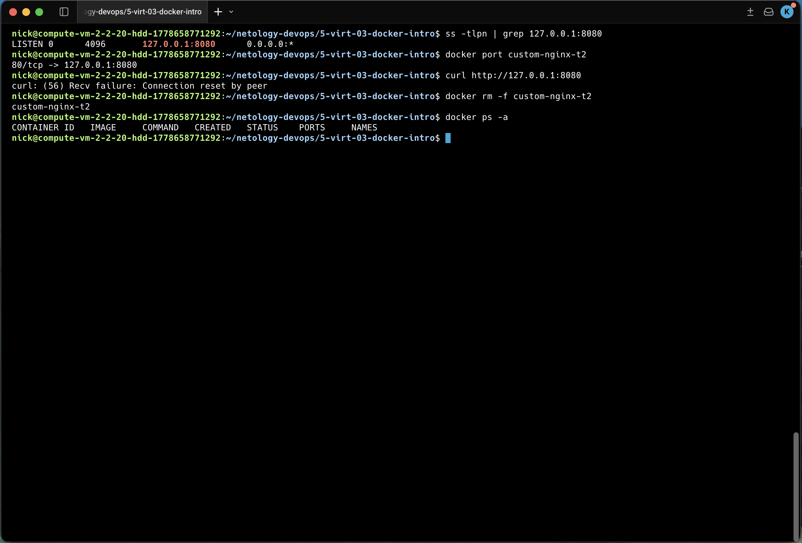

Суть проблемы состоит в том, что мы перенесли nginx в контейнере с 80 на 81 порт, а при запуске контейнера мы пробрасываем порт 8080 localhost на 80 порт контейнера с nginx, соответственно на 80 порту nginx не отвечает что видно по выводу curl.

Как исправить конфигурацию не изменяя конфиг nginx и не удаляя контейнер информацию найти не получилось. Найденые источники говорят либо о правке конфига либо удалении контейнера и запуска с новыми портами. Конечно есть вариант с запуском дополнительного контейнера с реверс-прокси, но не думаю что это решение в рамках этого задания. Пример источника из описания задания не открывается.

# Задача 4

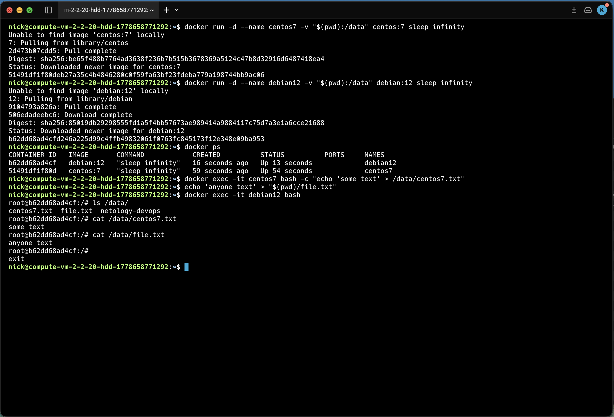

# Задача 5

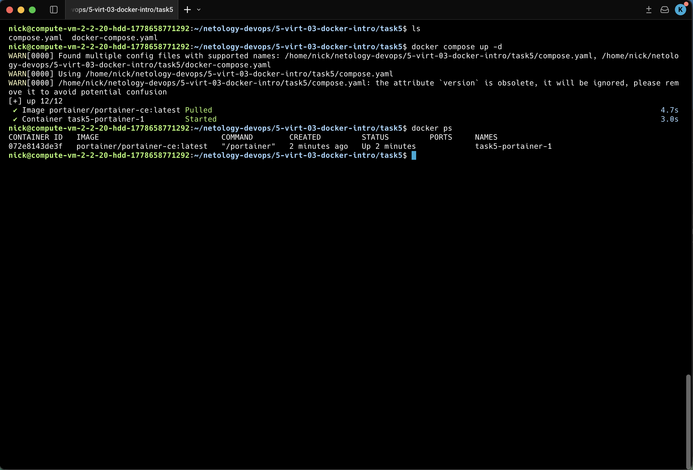

По умолчанию для compose-файла используется имя compose.yaml, а использование docker-compose.yaml оставлено для обратной совместимости, и следовательно запущены будут контейнеры из compose.yaml.
Используем директиву include в файле compose.yaml для внедрения содержимого файла docker-compose.yaml. 

[файл](task5/compose.yaml)

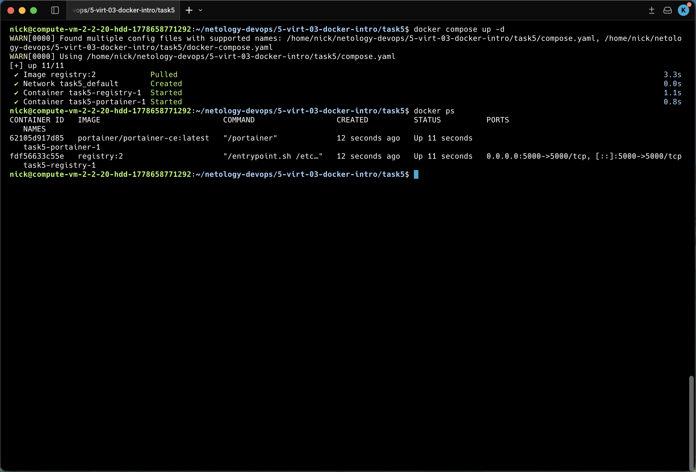

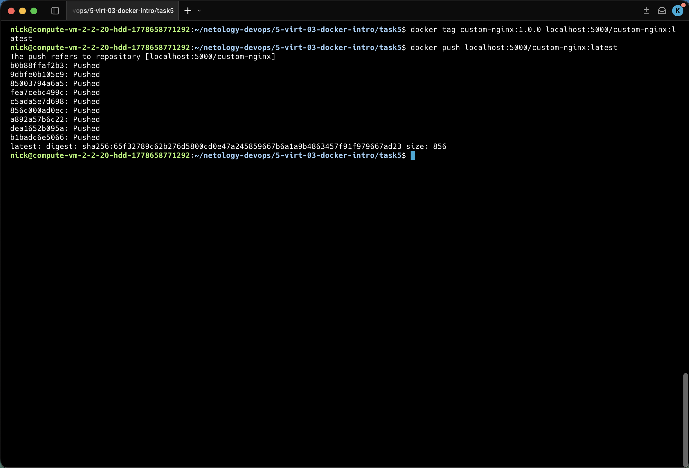

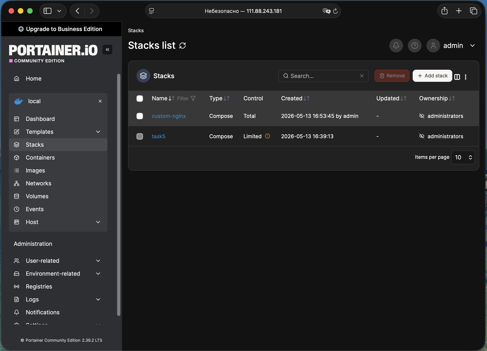

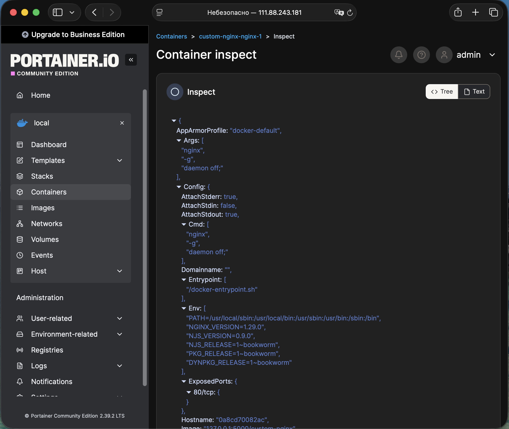

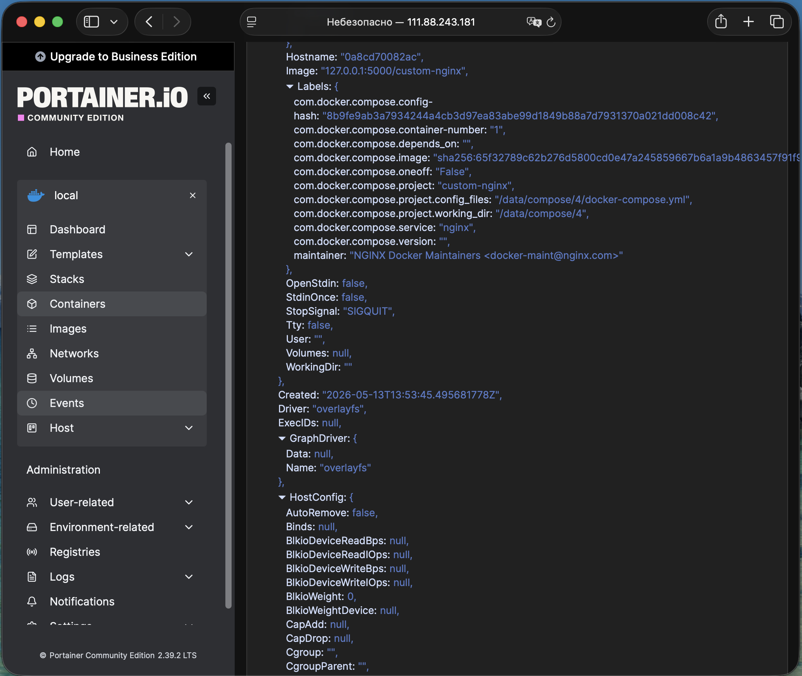

